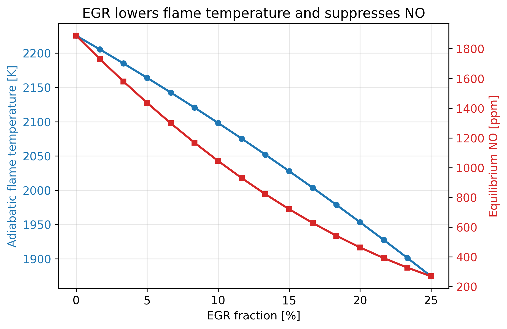
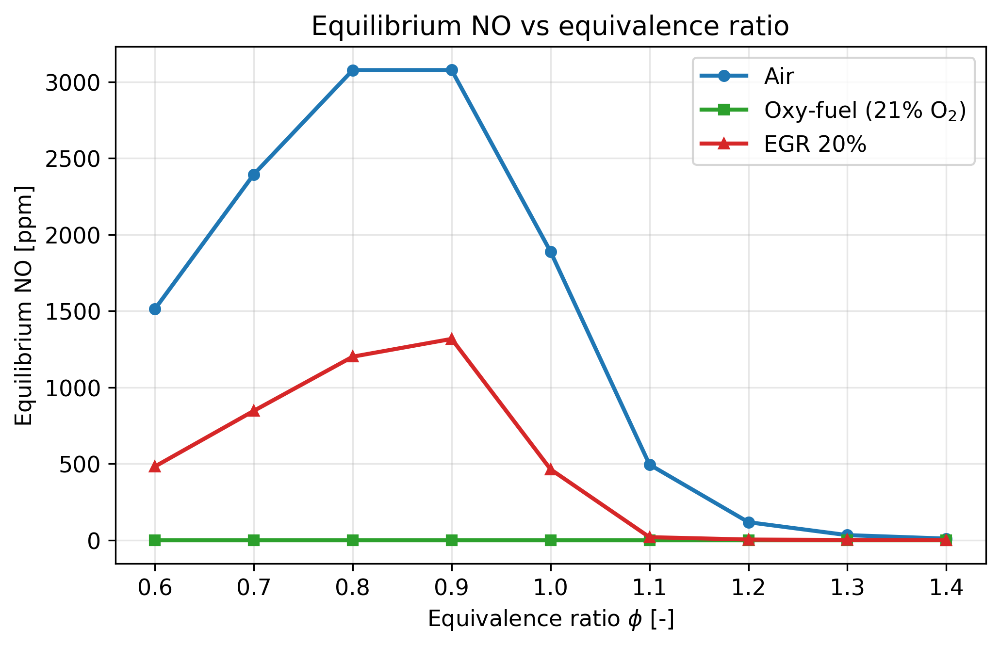
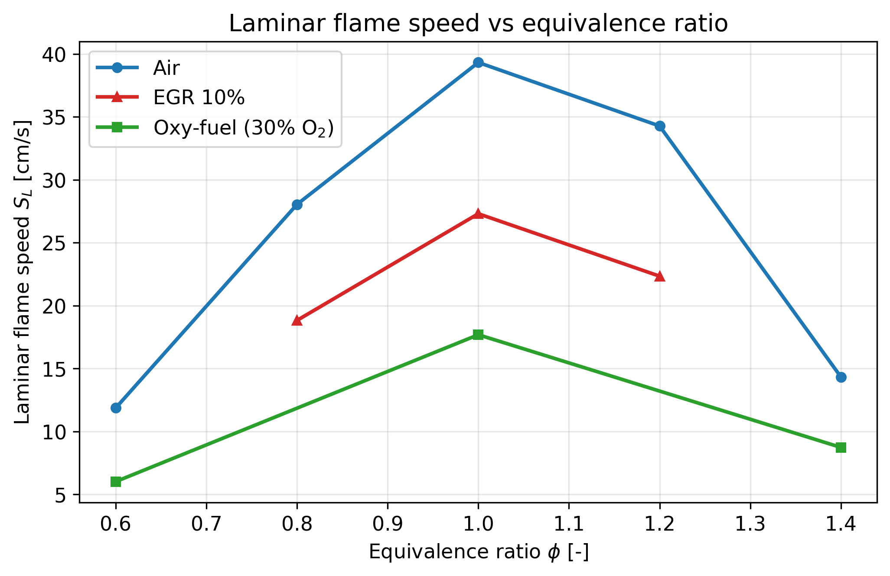
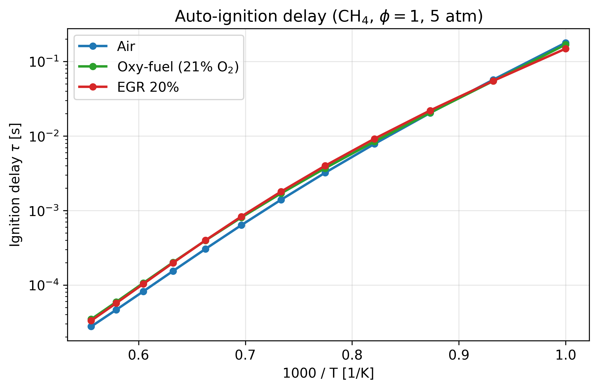

# EGR & Oxy-Fuel Effects on Methane Combustion

**Course project — _Metody Komputerowe w Spalaniu_ (Computer Methods in Combustion), MKWS 2026**
Warsaw University of Technology, Faculty of Power and Aeronautical Engineering

A [Cantera](https://cantera.org)-based study of how two carbon-management
strategies — **exhaust gas recirculation (EGR)** and **oxy-fuel combustion** —
reshape the combustion of methane compared with a conventional methane/air
baseline. Four physically distinct quantities are computed with one consistent
mechanism (GRI-Mech 3.0) so the effects can be compared on equal footing:

1. **Adiabatic flame temperature** — constant-enthalpy (HP) equilibrium
2. **Laminar flame speed** — 1-D freely-propagating premixed flame
3. **Auto-ignition delay** — 0-D constant-pressure reactor (Arrhenius sweep)
4. **NO formation** — equilibrium NO in the burned gas

## Key result

EGR and oxy-fuel both lower the flame temperature, slow the flame and lengthen
the ignition delay — and in return they suppress thermal NO by up to an order of
magnitude. Oxy-fuel, having no atmospheric nitrogen, removes thermal NO almost
entirely while producing a CO₂-rich, capture-ready exhaust.

| Quantity (φ = 1) | Air | EGR 20 % | Oxy-fuel (21 % O₂) |
|---|---|---|---|
| Adiabatic flame temperature [K] | 2225 | 1957 | 1783 |
| Peak laminar flame speed [cm/s] | ~39 | ~27 (EGR 10 %) | ~18 (30 % O₂) |
| Equilibrium NO peak [ppm] | ~3080 | ~1340 | ~0 |

## Selected figures

### NO suppression is bought with flame temperature


### Equilibrium NO vs equivalence ratio


### Laminar flame speed


### Auto-ignition delay (Arrhenius)


All eight figures live in [`results/`](results/) and the underlying numbers in
[`results/data/`](results/data/) as CSV.

## How to run

Requires Python 3.10+.

```bash
pip install -r requirements.txt

# fast sections (equilibrium, ignition, NOx) + their figures
python -m src.run equilibrium ignition nox

# 1-D laminar flames (slower; resumable helper, rerun until COMPLETE)
python gen_incremental.py flame_phi_air
python gen_incremental.py flame_phi_oxy
python gen_incremental.py flame_phi_egr
python gen_incremental.py flame_egr_speed
python gen_incremental.py flame_oxy_speed

# assemble the flame figures
python -m src.run flame_plots
```

Or simply reproduce everything in one go:

```bash
./reproduce.sh
```

## Project structure

```
src/
  config.py        global physical & numerical parameters
  mixtures.py      air / oxy-fuel / EGR fresh-charge definitions
  equilibrium.py   adiabatic flame temperature & equilibrium NO
  flame.py         1-D freely-propagating laminar flame (flame speed)
  kinetics.py      0-D reactor auto-ignition delay
  plots.py         matplotlib styling, CSV/figure output
  run.py           CLI: compute + plot each section
gen_incremental.py crash-proof, resumable 1-D flame generator
reproduce.sh       one-command regeneration of every figure
results/           generated figures (PNG, 300 dpi)
results/data/      generated data (CSV)
report/            LaTeX source + compiled PDF (thesis-style report)
```

## Model notes

- **Mechanism:** GRI-Mech 3.0 (53 species, 325 reactions), ships with Cantera
  and includes the nitrogen sub-mechanism needed for NO.
- **Reference state:** unburned gas at 300 K, 1 atm (ignition study at 5 atm).
- **EGR model:** a mole fraction of cooled burned gas (restricted to the stable
  bulk species CO₂, H₂O, N₂, O₂, CO) is mixed back into the fresh charge.
- **Oxy-fuel model:** the oxidiser is an O₂/CO₂ blend with a prescribed O₂ mole
  fraction; 21 % reproduces air's oxygen content with CO₂ as the bath gas.
- **Limitation:** NO is reported at chemical equilibrium, which over-predicts the
  absolute level reached in a finite residence time but preserves the correct
  sensitivity to temperature and to the presence of N₂.

## References

- D. G. Goodwin et al., *Cantera*, v3.2, 2024.
- G. P. Smith et al., *GRI-Mech 3.0*, Gas Research Institute.
- C. K. Law, *Combustion Physics*, Cambridge University Press, 2006.
- S. R. Turns, *An Introduction to Combustion*, 3rd ed., McGraw-Hill, 2012.
